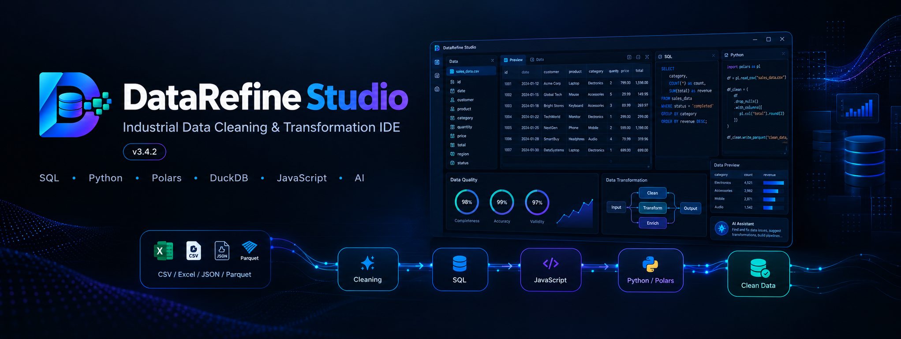
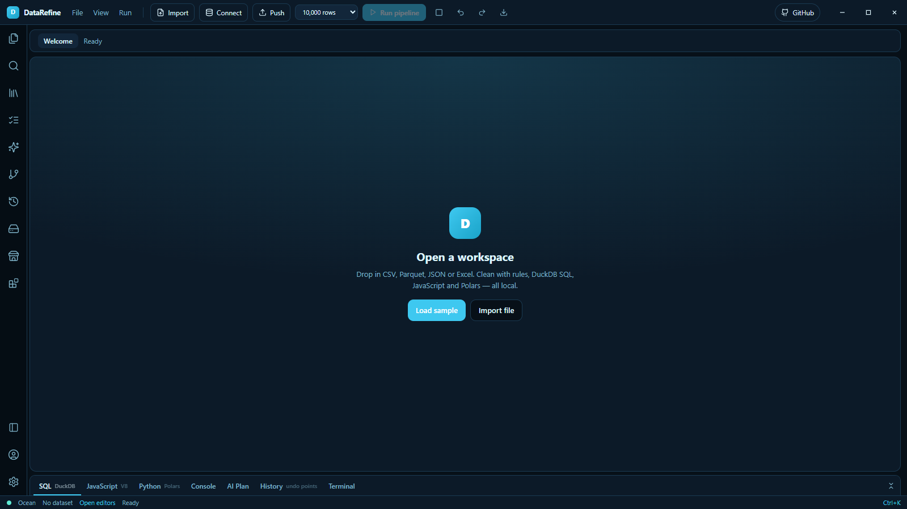
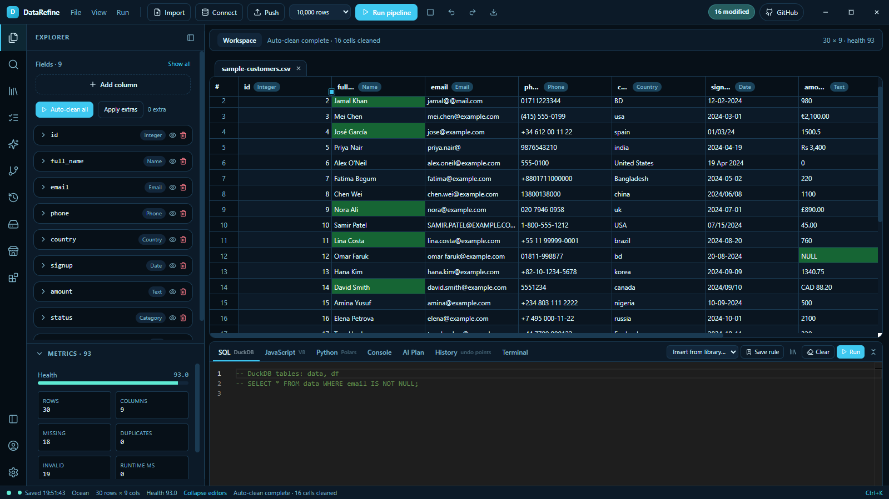
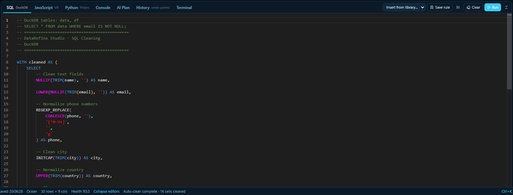
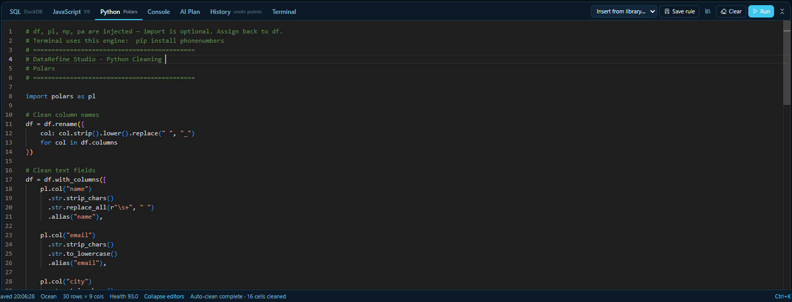

# ⚡ DataRefine Studio

### Industrial-grade local-first data cleaning & transformation IDE

<p align="center">
  
</p>

<p align="center">
  <strong>Clean. Transform. Analyze. Automate.</strong><br>
  A powerful desktop data workspace combining spreadsheet workflows, DuckDB SQL, JavaScript, Python, Polars and AI-assisted data operations.
</p>

<p align="center">


</p>

<p align="center">

**[⭐ Star this project](../../stargazers)** ·
**[🐛 Report a bug](../../issues)** ·
**[💡 Request a feature](../../issues)** ·
**[📝 Leave a review](https://datarefine-review.vercel.app/reviews)**

</p>

---

## 🖥️ The Data Workspace

<p align="center">
  
</p>

<p align="center">
  
</p>

DataRefine Studio is built for people who work with messy, inconsistent and constantly changing datasets.

Instead of switching between a spreadsheet, SQL editor, Python notebook and scripting environment, DataRefine brings the workflow into one desktop application.

### Built around a simple idea:

> **Your data should stay local, your workflow should stay flexible, and your cleaning pipeline should stay reproducible.**

---

# 🚀 Why DataRefine Studio?

| Capability                        | DataRefine Studio |
| --------------------------------- | ----------------- |
| Spreadsheet-style data grid       | ✅                 |
| CSV / TSV / XLSX / JSON / Parquet | ✅                 |
| DuckDB SQL                        | ✅                 |
| Python + Polars                   | ✅                 |
| JavaScript V8                     | ✅                 |
| Universal cleaning rules          | ✅                 |
| Column-level cleaning rules       | ✅                 |
| Cleaning pipelines                | ✅                 |
| Cleaning reports                  | ✅                 |
| Database connections              | ✅                 |
| Data push/write-back              | ✅                 |
| Plugin architecture               | ✅                 |
| IntelliSense                      | ✅                 |
| AI providers                      | ✅                 |
| GitHub integration                | ✅                 |
| Local-first workflow              | ✅                 |
| Optional remote licensing         | ✅                 |

---

# 🧠 Architecture

```text
                         ┌─────────────────────────────┐
                         │       DataRefine Studio      │
                         │        Tauri Desktop         │
                         └──────────────┬──────────────┘
                                        │
                         ┌──────────────▼──────────────┐
                         │       React 19 + Vite        │
                         │ TypeScript + Tailwind + Grid │
                         │         Monaco Editor        │
                         └──────────────┬──────────────┘
                                        │
                         Local HTTP / IPC Bridge
                                        │
                         ┌──────────────▼──────────────┐
                         │       Python Engine          │
                         │          FastAPI             │
                         ├──────────────────────────────┤
                         │ DuckDB                       │
                         │ Polars                       │
                         │ PyArrow                      │
                         │ SQLite WAL                   │
                         └──────────────┬──────────────┘
                                        │
                  ┌─────────────────────┼─────────────────────┐
                  │                     │                     │
             Universal               SQL                JavaScript
               Rules               DuckDB                 V8
                  │                     │                     │
                  └─────────────────────┼─────────────────────┘
                                        │
                                   Python / Polars
                                        │
                                        ▼
                              Cleaned Data / Reports
```

---

# ⚙️ Processing Pipeline

DataRefine uses a deterministic multi-stage pipeline:

```text
INPUT DATA
    │
    ▼
┌──────────────────────┐
│ Universal Rules      │
│ Trim / Unicode / etc │
└──────────┬───────────┘
           ▼
┌──────────────────────┐
│ DuckDB SQL           │
│ Filtering / Joins    │
│ Aggregation / Logic  │
└──────────┬───────────┘
           ▼
┌──────────────────────┐
│ JavaScript V8        │
│ Row-level transforms │
└──────────┬───────────┘
           ▼
┌──────────────────────┐
│ Python + Polars      │
│ Advanced processing  │
└──────────┬───────────┘
           ▼
      CLEAN DATA
```

**Pipeline order:**

`Universal Rules → DuckDB SQL → JavaScript V8 → Python Polars`

---

# 📊 Data Formats

Import the formats you already work with:

* CSV
* TSV
* XLSX
* JSON
* Parquet

Export cleaned datasets together with an optional cleaning report.

### Cleaning Report

The generated report can include:

* Cells cleaned
* Cleaning operations by column
* Cleaning operations by stage
* Data health before cleaning
* Data health after cleaning

The health metric is calculated as:

```text
Health = 100 × (1 − InvalidCells / TotalCells)
```

---

# 🧹 Intelligent Data Cleaning

DataRefine includes an automatic cleaning layer for common data-quality problems.

### Auto-clean

```text
Trim whitespace
       ↓
Remove hidden Unicode
       ↓
Normalize Unicode (NFC)
       ↓
Normalize spaces
       ↓
Normalize line endings
       ↓
Remove blank lines
       ↓
Empty values → NULL
```

You can also create rules at the column level.

```text
Explorer
   └── Column
        └── Cleaning Rule
              ├── Universal
              └── Regex
```

---

# 🧑‍💻 Three Powerful Editors

## SQL

Use DuckDB for analytical SQL directly against your dataset.
<p align="center">
  
</p>

---

## Python

Powered by Polars, NumPy and PyArrow.

```python
df = df.with_columns(
    pl.col("name")
      .str.strip_chars()
      .alias("name")
)
```
<p align="center">
  
</p>

The Python stage provides injected objects such as:

```text
df
pl
np
pa
```

---

## JavaScript

Use JavaScript for flexible row-level transformations.

```javascript
return {
    ...row,
    normalized_name: row.name?.trim().toLowerCase()
};
```

---

# 🧠 IntelliSense

DataRefine provides built-in IntelliSense for:

* SQL
* Python
* JavaScript

Examples include:

```text
DuckDB keywords
Dataset columns
Polars APIs
Python modules
JavaScript row fields
Plugin-provided snippets
```

Press:

```text
Ctrl + Space
```

to open suggestions.

---

# 🔌 Plugin Architecture

DataRefine includes an extension system designed to expand the application without changing the core workflow.

```text
DataRefine Plugin
       │
       ├── datarefine.plugin.json
       ├── capabilities
       ├── views
       ├── options
       └── processing logic
```

Plugins can provide:

* New processing capabilities
* New UI views
* New options
* New workflows
* Additional snippets

The application currently includes:

* **Clean Kit**
* **Studio UI Kit**

---

# 🤖 AI Integration

DataRefine can connect to multiple AI providers.

Supported providers include:

```text
Ollama
OpenAI
Google Gemini
Anthropic
OpenRouter
```

The AI layer can be used alongside the existing local data-processing workflow.

---

# 🗄️ Database Connectivity

DataRefine can connect to external databases through the **Connect** workflow.

```text
Host
Port
SSL
SSH Tunnel
Credentials
Connection Name
```

After connecting, datasets can be queried using SQL.

```sql
SELECT *
FROM your_table;
```

Cleaned data can also be pushed back into a database using:

```text
Replace
Append
Fail
```

---

# 🖥️ Desktop Technology

| Layer              | Technology      |
| ------------------ | --------------- |
| Desktop Shell      | Tauri v2        |
| Frontend           | React 19        |
| Language           | TypeScript      |
| Build              | Vite            |
| Styling            | Tailwind CSS    |
| Data Grid          | Glide Data Grid |
| Code Editor        | Monaco          |
| Backend Engine     | Python          |
| API                | FastAPI         |
| Analytics          | DuckDB          |
| DataFrame Engine   | Polars          |
| Columnar Data      | PyArrow         |
| Local State        | SQLite WAL      |
| JavaScript Runtime | V8              |

---

# 📦 Production Architecture

The production Windows application packages the Python engine into a standalone executable.

```text
DataRefine Studio
│
├── Tauri Desktop
│
├── React UI
│
├── Embedded Engine
│   ├── FastAPI
│   ├── DuckDB
│   ├── Polars
│   ├── PyArrow
│   └── SQLite
│
└── Local User Data
    └── %LOCALAPPDATA%\DataRefine Studio
```

Users do **not** need to install Python or pip for the packaged Windows engine.

---

# 🛠️ Development Setup

## Requirements

| Tool    | Version   |
| ------- | --------- |
| Node.js | 20+       |
| Python  | 3.11–3.14 |
| Rust    | 1.88+     |
| Tauri   | v2        |

### Windows

Install Python dependencies:

```powershell
py -3.12 -m pip install -r requirements.txt
```

Install frontend dependencies:

```powershell
npm install --legacy-peer-deps
```

Start development:

```powershell
npm run tauri dev
```

---

# 🌐 Browser Development Mode

For frontend/browser development:

```bash
npm run dev
```

Frontend:

```text
http://localhost:1420
```

The local engine uses a dynamically selected local port, with `17831` as the preferred default.

---

# 🏗️ Build Windows Installer

On a Windows build machine:

```powershell
npm ci
npm run tauri build
```

The production NSIS installer is generated under:

```text
src-tauri/target/release/bundle/nsis/
```

The installer provides:

* Start Menu shortcut
* Optional Desktop shortcut
* Upgrade support
* Uninstall support
* Administrator elevation
* Embedded application engine

# 🔒 Local-First by Design

DataRefine is designed around a local processing architecture.

Your data-processing workflow can remain on the machine:

```text
Dataset
   ↓
Local Engine
   ↓
DuckDB / Polars
   ↓
Cleaning Pipeline
   ↓
Local Result
```

This architecture helps keep large data workflows efficient without serializing the entire grid into the browser.

---

# 📁 Project Structure

```text
DataRefineStudio/
│
├── src/
│   └── React UI
│
├── sidecar/
│   └── Python engine + FastAPI
│
├── src-tauri/
│   └── Tauri v2 desktop shell
│
├── services/
│   └── internal/
│       └── policy-engine/
│
├── public/
│   └── sample-customers.csv
│
├── plugins/
│
├── requirements.txt
│
└── package.json
```

---

# 🎨 Built-in Themes

DataRefine includes multiple interface themes:

```text
Midnight
Ocean
Dawn
Forest
Dusk
Ember
Nord
Sand
```

---

# 📈 Designed for Real Data Work

DataRefine is suitable for workflows such as:

```text
CSV Cleaning
      ↓
Data Validation
      ↓
Normalization
      ↓
SQL Transformation
      ↓
Python Processing
      ↓
Quality Analysis
      ↓
Cleaning Report
      ↓
Export
```

It is especially useful for:

* Data analysts
* Data engineers
* Developers
* Researchers
* Operations teams
* Data-quality workflows
* ETL preparation
* Dataset preparation
* Spreadsheet-heavy workflows

---

# ⭐ Give DataRefine a Review

Have you used DataRefine Studio?

Your feedback directly helps improve the product and prioritize future features.

### 📝 Leave your review here:

<p align="center">

## [⭐ Write a DataRefine Review](https://datarefine-review.vercel.app/reviews)

**Share your experience → Rate the app → Tell us what should improve**

</p>

The review page allows you to submit a rating, written review and optional role information.

---

# 🗺️ Roadmap

The project is actively evolving toward a more complete professional data-workbench experience.

### Current

* [x] Desktop IDE
* [x] Spreadsheet-style grid
* [x] DuckDB SQL
* [x] Python / Polars
* [x] JavaScript V8
* [x] Cleaning pipelines
* [x] Plugin architecture
* [x] IntelliSense
* [x] Database connectivity
* [x] Cleaning reports
* [x] AI provider integration
* [x] Remote licensing architecture

### Future

* [ ] Expanded enterprise connectors
* [ ] Advanced data-quality profiling
* [ ] More cloud-connected plugins
* [ ] Advanced workflow automation
* [ ] Team collaboration
* [ ] More database integrations
* [ ] Expanded AI data agents

---

# 🤝 Contributing

Contributions, bug reports, feature requests and ideas are welcome.

Before submitting a pull request:

```text
1. Fork the repository
2. Create a feature branch
3. Make your changes
4. Test the application
5. Commit your changes
6. Open a Pull Request
```

For bugs and feature requests, use the GitHub Issues section.

---

# ⭐ Support the Project

If DataRefine Studio is useful to you:

**⭐ Star the repository**

**🐛 Report issues**

**💡 Suggest features**

**📝 Leave a review**

**📢 Share the project**

Every bit of feedback helps shape the next version.

---

<p align="center">

### ⚡ DataRefine Studio

**A modern desktop environment for serious data cleaning and transformation.**

<br>

[⭐ Star on GitHub](../../stargazers) ·
[🐛 Issues](../../issues) ·
[📝 Write a Review](https://datarefine-review.vercel.app/reviews)

</p>

<p align="center">
  <sub>DataRefine Studio v3.4.2</sub>
</p>
